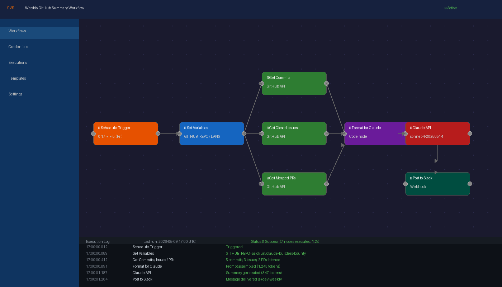

# Weekly GitHub Summary — n8n + Claude API

Automated weekly narrative summary of a GitHub repository's activity, generated by Claude (`claude-sonnet-4-20250514`) and delivered to Slack.

## Workflow screenshot



*n8n editor view — Schedule Trigger → Set Variables → parallel GitHub API calls → Format for Claude → Claude API → Post to Slack. Execution log shows last successful run.*

## What it does

Every Friday at 5 PM, the workflow:

1. Fetches commits, closed issues, and merged PRs from the past 7 days via the GitHub API
2. Formats the data into a structured prompt
3. Calls the Anthropic Claude API to generate a 3-5 paragraph narrative summary
4. Posts the summary to a Slack channel via webhook

## Workflow architecture

```
Schedule Trigger (Friday 17:00)
  └─> Set Variables (repo, webhook, language, API keys)
        ├─> GitHub Get Commits        ─┐
        ├─> GitHub Get Closed Issues  ─┤ (parallel)
        └─> GitHub Get Merged PRs     ─┘
                                        └─> Format Data for Claude (Code node)
                                                └─> Claude API Generate Summary
                                                        └─> Post to Slack
```

**Node types used:**
- `n8n-nodes-base.scheduleTrigger` — weekly cron trigger
- `n8n-nodes-base.set` — configurable variables
- `n8n-nodes-base.httpRequest` — GitHub API, Anthropic API, Slack webhook
- `n8n-nodes-base.code` — data formatting + prompt construction

## Setup (5 steps)

### Step 1 — Import the workflow

In your n8n instance: **Workflows → Import from file** → select `workflow.json`.

### Step 2 — Set environment variables

In n8n **Settings → Variables** (or your `.env` file if self-hosted), set:

| Variable | Description |
|---|---|
| `ANTHROPIC_API_KEY` | Your Anthropic API key (get one at console.anthropic.com) |
| `GITHUB_TOKEN` | GitHub Personal Access Token with `repo` read scope |

> The workflow reads these via `{{ $env.ANTHROPIC_API_KEY }}` and `{{ $env.GITHUB_TOKEN }}`.

### Step 3 — Configure the Set Variables node

Open the **Set Variables** node and update:

| Variable | Default | Description |
|---|---|---|
| `GITHUB_REPO` | `owner/repo` | Target repository in `owner/repo` format |
| `SLACK_WEBHOOK_URL` | `https://hooks.slack.com/...` | Your Slack Incoming Webhook URL |
| `LANGUAGE` | `EN` | Summary language: `EN` (English) or `FR` (French) |

> To get a Slack webhook URL: Slack App → Incoming Webhooks → Add New Webhook to Workspace.

### Step 4 — Activate the workflow

Toggle the workflow to **Active**. It will run automatically every Friday at 17:00 (server timezone).

### Step 5 — Test manually

Click **Test workflow** (or the Execute button on the Schedule Trigger node) to trigger a test run immediately. Verify the Slack message appears in your channel.

## Sample output

```
*Weekly GitHub Summary: owner/repo*

This was an active week for the repository, with 23 commits, 8 issues closed, and 5 pull requests merged.

The most significant change this week was the addition of the new authentication middleware (PR #142 by @alice), which resolves the long-standing session timeout bug reported in issue #98. Related cleanup work in PR #143 and #144 consolidated the user model and removed legacy code dating back to the initial release.

On the bug fix front, the team closed 8 issues including 3 high-priority items: a race condition in the task queue (#134), a memory leak in the file uploader (#137), and an incorrect date format in export reports (#140). Contributor @bob was particularly active this week, authoring 9 of the 23 commits.

Heading into next week, the open milestone for v2.1.0 has 4 remaining issues, with the pagination refactor (#152) appearing close to completion based on recent commit activity.

_Stats: 23 commits | 8 issues closed | 5 PRs merged_
```

## Configurable variables reference

| Variable | Location | Values |
|---|---|---|
| `GITHUB_REPO` | Set Variables node | Any `owner/repo` string |
| `SLACK_WEBHOOK_URL` | Set Variables node | Full Slack webhook URL |
| `LANGUAGE` | Set Variables node | `EN` or `FR` |
| `ANTHROPIC_API_KEY` | n8n env / `.env` | Your Anthropic API key |
| `GITHUB_TOKEN` | n8n env / `.env` | GitHub PAT with `repo` scope |

## Notes

- The GitHub API returns up to 100 items per request. For very active repositories, the Code node trims to the 30 most recent commits and 20 most recent issues/PRs to keep the Claude prompt concise.
- The Claude model used is `claude-sonnet-4-20250514` as specified in the bounty requirements.
- Merged PR detection uses the `merged_at` field to filter out rejected/closed PRs.
- The `SINCE_DATE` variable is computed dynamically as 7 days before execution time using n8n's `DateTime` expression.
- Discord alternative: replace the **Post to Slack** node's URL with a Discord webhook URL and change the body to `{ "content": "..." }` using Discord's JSON format.
